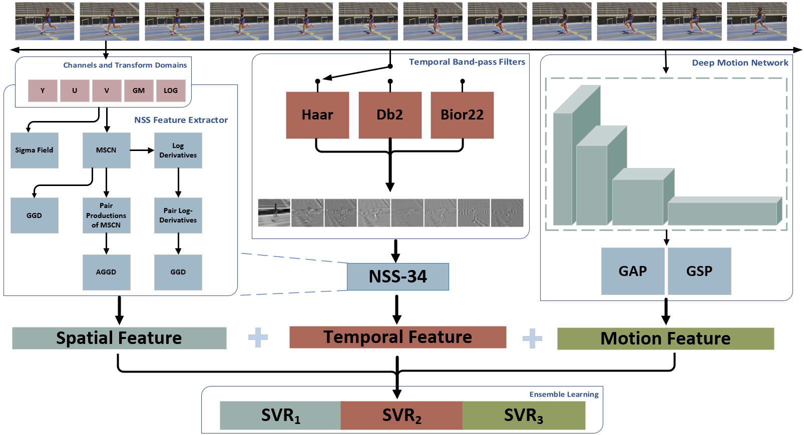
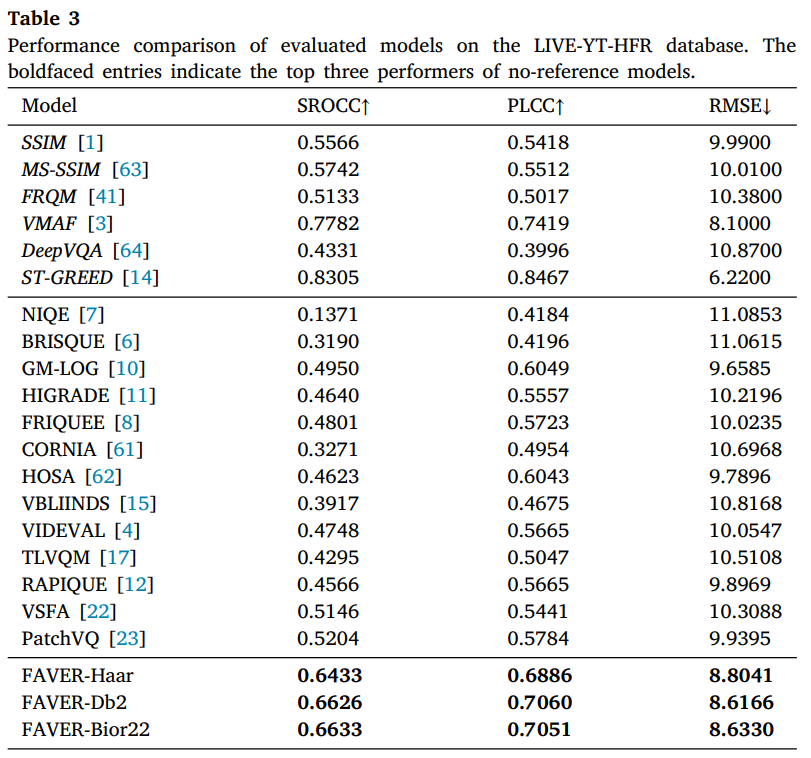

<div align="center">
  <h1><a href="https://www.sciencedirect.com/science/article/pii/S092359652400002X">FAVER: Blind quality prediction of variable frame rate videos</a></h1> 
  

<div>
      Qi Zheng<sup>1</sup>,
      Zhengzhong Tu<sup>2</sup>,
      Pavan C. Madhusudana<sup>2</sup>,
      Xiaoyang Zeng<sup>1</sup>,
      Alan C. Bovik<sup>2</sup>,
      Yibo Fan<sup>1</sup>
  </div>
  <div>
  <sup>1</sup>Fudan University, <sup>2</sup>The University of Texas at Austin
       </div> 

<div>
    <b>Signal Processing: Image Communication, 2024</b>
</div> 

<br>
<div>
    An early variant version can be refered to <a href="https://ieeexplore.ieee.org/document/9746997">No-Reference Quality Assessment of Variable Frame-Rate Videos Using Temporal Bandpass Statistics</a>, ICASSP 2022.
</div>


  <h2>Framework</h2> 

<div style="width: 80%; text-align: center; margin:auto;">
      
</div>

<h2>Main Results</h2> 
<div style="width: 50%; text-align: center; margin:auto;">
      
</div>

</div>

## Quicker Start 
### 1. Compute Spatial and Temporal Features
```shell
run src/compute_LIVE_HFR_FAVER_features.m
```

### 2. Compute Deep Motion Features
```shell
python CNNfeatures_Motion_persec_live.py
```

### 3. Ensembel Learning and Performance Evaluation
- Concatenate spatial, temporal, and motion features
- Performance Evaluation
```shell
bash run_all_bvqa_regression_by_content.sh
```

## Citation

```bibtex
@article{zheng2024faver,
title = {FAVER: Blind quality prediction of variable frame rate videos},
journal = {Signal Processing: Image Communication},
volume = {122},
pages = {117101},
year = {2024},
issn = {0923-5965},
doi = {https://doi.org/10.1016/j.image.2024.117101},
url = {https://www.sciencedirect.com/science/article/pii/S092359652400002X},
author = {Qi Zheng and Zhengzhong Tu and Pavan C. Madhusudana and Xiaoyang Zeng and Alan C. Bovik and Yibo Fan}
}
```
